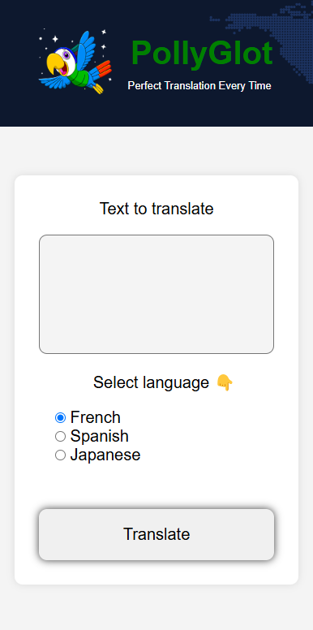

# PollyGlot AI Translation App



## What it is

- A simple OpenAI API app that will translate from English to French, Spanish and Japanese.
- Worked on as a project from the Scrimba AI Engineering course
- It uses plain HTML/CSS/JS as well as Node.js and the OpenAI API

## Getting started

- Create an OpenAI API account and get an API key you can use (make sure you set spending limits)
- Create a `.env` file and add a environment variable called `OPENAI_API_KEY` with your API key from the step above
  - You can also add a `PORT` environment variable if you'd like, but it's not a problem if you don't as it will default to 3000
- Open up a terminal and run
  ```bash
  npm start
  ```
- open /public/index.html in a browser and off you go!
